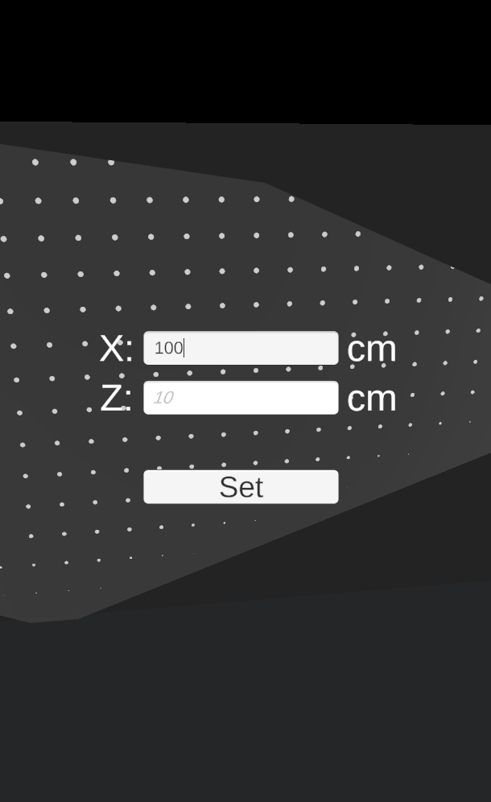

# DevBlog 2

## Progress

As we started to work on the requirements for our MVP, there was one step to do before we could divide the work, create the initial project. We decided that we should utilize as much as we could from what has already been implemented in the AR Foundation template in Unity, and therefore we created a template AR project and started to build on top of that.

Shortly after, we found out that this was not the best decision. Placing objects and then moving, scaling or rotating them worked out of the box, but we did not want some of the functionality (like rotation) and some we wanted to modify (scaling - so that the object only scales on 2 axes). After few wasted hours we agreed that we should start from scratch because it will be much easier to modify the logic of our app as we want to without spending too much time on understanding how the underlined code works.

After switching to the blank project, things went smoothly and implementation ogt under way. On our meeting (2.10.) we managed to have 3 requirements completed and the other 4 for the MVP were all at least in progress. The expected day to have the MVP ready was set for Friday 4.10.

For the following week we expect to work on the **core** requirements. The hand-in date was set for the 15.10.

## App

### Plane and object placement

For our use case, we only require vertical plane detection (walls). For object placement we implemented a simple `FramePlacer` script where we used the `PressInputBase` class that wasgiven to us during one of the lectures to support both screen touch and clicks in the simulator.

```
public class FramePlacer : PressInputBase
{
    [SerializeField] private ARRaycastManager raycastManager;
    [SerializeField] private GameObject objectToPlace;
    private static readonly List<ARRaycastHit> _hits = new();
    private bool _framePlaced;

    protected override void OnPressBegan(Vector3 position)
    {
        base.OnPressBegan(position);
        if (_framePlaced) return;
        if (EventSystem.current.IsPointerOverGameObject()) return;
        if (!raycastManager.Raycast(position, _hits, TrackableType.PlaneWithinPolygon)) return;
        var hitpose = _hits[0].pose;
        Instantiate(objectToPlace, hitpose.position, hitpose.rotation);
        _framePlaced = true;
    }
}
```


### Custom object size

What is a bit more interesting is the definition of custom scale of the placed object (frame in our case). We want the user to be able to type in 2 values; width and height.

We created a basic UI with 2 input fields and a button. THen we implemented a script called `SetFrameSizesManager` where wi assign the input fields and button in the inspector and then in the `Awake` method we add a listener to the button's `onClick` event so that whenever it is clicked, the values from the input fields are read and correctly set for the object that is being placed.

```
    void Awake()
    {
        HideInvalidInputText();
        UI = GetComponent<Canvas>();
        HideUI();
        setButton.onClick.AddListener(() =>
        {
            if (float.TryParse(sizeXInput.text, out var sizeX) && float.TryParse(sizeZInput.text, out var sizeZ))
            {
                HideInvalidInputText();
                framePlacer.PlaceFrame(sizeX, sizeZ);
                HideUI();
            }
            else
            {
                ShowInvalidInputText();
            }
        });
    }
```

There is a lot of `HideUI` methods in the figure above, but how and when do we show the UI for setting the width and height? It is whown when a user places an object:

```
    protected override void OnPressBegan(Vector3 position)
    {
        base.OnPressBegan(position);
        if (_framePlaced) return;
        if (EventSystem.current.IsPointerOverGameObject()) return;
        if (!raycastManager.Raycast(position, _hits, TrackableType.PlaneWithinPolygon)) return;

        setFrameSizesCanvas.enabled = true;
    }
```

The rest of the placing action takes place once the sizes are set. We make sure to scale the sizes correctly according to the real world (we found that 1 unity unit is approx. 1 meter).

This is how the UI looks like: 




### Save project
In order to save the project we added SaveManager.cs with `TakeScreenshotAndSave` method. We decided to save the project to the photo gallery of user, instead of saving it to our application. This will save us some time, because we wouldn't have to create another screen and display saved projects. Furthemore, we implemented saving only for Android, as iOS needed additional setup. 

This method provides path to DCIM directory, where photos are usually saved. We also create PhotoWallPlanner album, so it's easier for user to find the project.
``` 
private string GetAndroidExternalStoragePath()
{
    if (Application.platform != RuntimePlatform.Android)
        return Application.persistentDataPath;

    var jc = new AndroidJavaClass("android.os.Environment");
    var path = jc.CallStatic<AndroidJavaObject>("getExternalStoragePublicDirectory",
         jc.GetStatic<string>("DIRECTORY_DCIM"))
         .Call<string>("getAbsolutePath");

    path = Path.Combine(path, "PhotoWallPlanner");
    if (!Directory.Exists(path))
    {
        Directory.CreateDirectory(path);
    }
    return path;
}
``` 
When testing the application on device, we were able to find the saved project in device files, however not in a gallery. After some research we found out we need to "notify" the gallery, so that image can be added. The following code is using Android Media Scanner to notify the gallery about the newly saved image.
```
AndroidJavaClass mediaScanner = new AndroidJavaClass("android.media.MediaScannerConnection");
AndroidJavaClass playerActivity = new AndroidJavaClass("com.unity3d.player.UnityPlayer");
AndroidJavaObject activity = playerActivity.GetStatic<AndroidJavaObject>("currentActivity");
mediaScanner.CallStatic("scanFile", activity, new string[] { filePath }, null, null);
``` 


